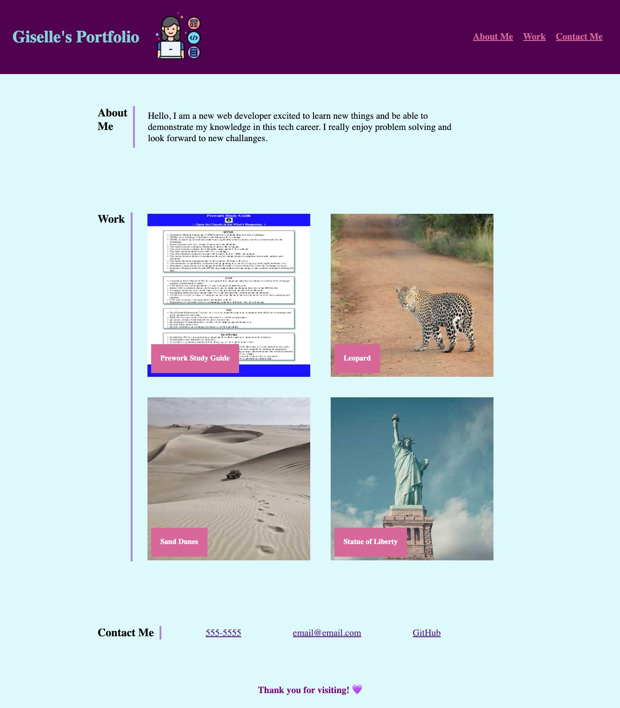

# My Portfolio

## Description

The reason for this website was to have a portfolio webpage that includes the work that I have been doing throughout the bootcamp. Hence, whenever any recruiter wants to know more information about myself and the work I have done, it will be detailed here. 

## Usage

You can access the portfolio website at https://gtorresv.github.io/venus/. When you get to the page you will notice the about me, work, and contact me tabs on the top right side of the webpage. Whenever you click on any of the tabs it will scroll down to its corresponding section. Also, whenever you hover over any of the application images, they will glow or have a purple shadow and be larger in size. Once you click on the image, it should take you to the deployed website.

Here is an example picture of the deployed portfolio:

## Credits

For the avatar image I used the developer icons created by Flat Icons (Flaticon) - https://www.flaticon.com/free-icons/developer. I also used image styling resources from W3schools - https://www.w3schools.com/howto/howto_css_image_text_blocks.asp and https://www.w3schools.com/howto/howto_css_image_avatar.asp. For the application image placeholders I used Lorem Picsum - https://picsum.photos/images. 

## License

Please refer to the LICENSE on the repository.